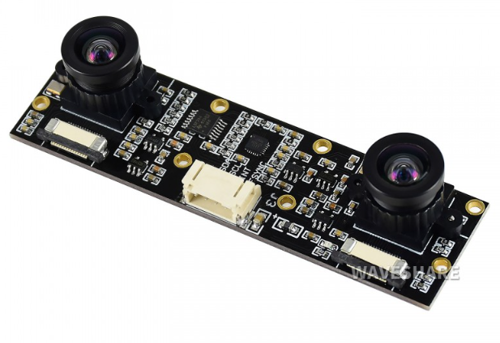
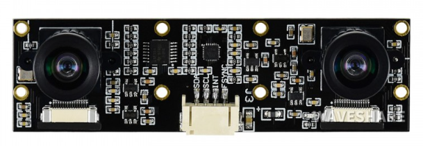
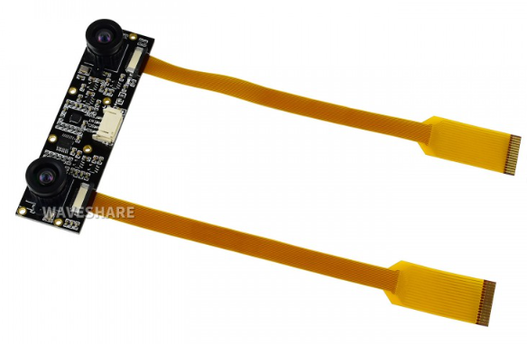
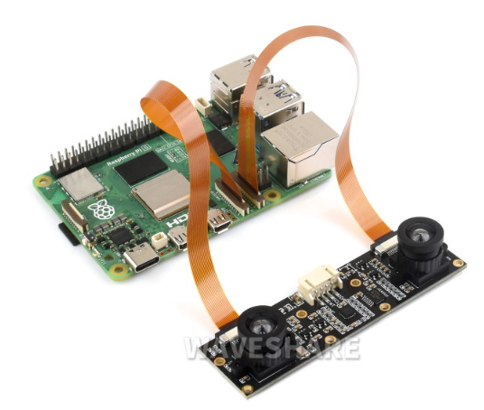
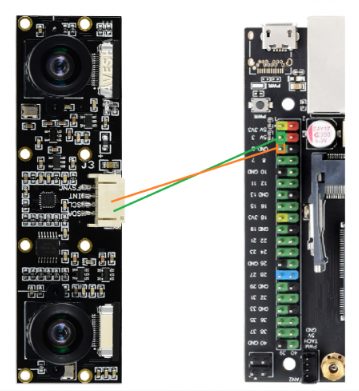

# Binocular Camera Module, Dual IMX219, 8 Megapixels, Applicable for Jetson Nano and Raspberry Pi, Stereo Vision, Depth Vision


* 링크 :
   * https://www.waveshare.com/product/ai/cameras/imx219-83-stereo-camera.htm?___SID=U
   * https://www.waveshare.com/wiki/IMX219-83_Stereo_Camera
 
## IMX219-83 Stereo Camera
### Waveshare IMX219-83 Stereo Camera Module

   <br>
 <br>

 <br>

## Overview

Dual IMX219 camera module with 8 Megapixels per camera and onboard ICM20948 9-axis IMU sensor, designed for Jetson Nano and Raspberry Pi.

---

## Specifications
   * 8 Megapixels
   * Sensor: Sony IMX219
   * Resolution: 3280 × 2464 (per camera)
   * Lens specifications:
      * CMOS size: 1/4inch
      * Focal Length: 2.6mm
      * Angle of View: 83/73/50 degree (diagonal/horizontal/vertical)
      * Distortion: <1%
      * Baseline Length: 60mm
   * ICM20948:
      * Accelerometer:
         * Resolution: 16-bit
         * Measuring Range (configurable): ±2, ±4, ±8, ±16g
         * Operating Current: 68.9uA
      * Gyroscope:
         * Resolution: 16-bit
         * Measuring Range (configurable): ±250, ±500, ±1000, ±2000°/sec
         * Operating Current: 1.23mA
      * Magnetometer:
         * Resolution: 16-bit
         * Measuring Range: ±4900μT
         * Operating Current: 90uA
   * Dimension: 24mm × 85mm

### Camera (Sony IMX219)

| Parameter | Value |
|-----------|-------|
| Resolution | 3280 × 2464 (per camera) |
| Sensor | Sony IMX219 |
| CMOS size | 1/4 inch |
| Focal Length | 2.6 mm |
| Angle of View (diagonal/horizontal/vertical) | 83° / 73° / 50° |
| Distortion | < 1% |
| Baseline Length | 60 mm |

### ICM20948 9-Axis IMU

#### Accelerometer

| Parameter | Value |
|-----------|-------|
| Resolution | 16-bit |
| Measuring Range (configurable) | ±2, ±4, ±8, ±16 g |
| Operating Current | 68.9 µA |

#### Gyroscope

| Parameter | Value |
|-----------|-------|
| Resolution | 16-bit |
| Measuring Range (configurable) | ±250, ±500, ±1000, ±2000 °/sec |
| Operating Current | 1.23 mA |

#### Magnetometer

| Parameter | Value |
|-----------|-------|
| Resolution | 16-bit |
| Measuring Range | ±4900 µT |
| Operating Current | 90 µA |

### Physical

| Dimension |
|-----------|
| 24 mm × 85 mm |

---

## Working with Jetson Nano

### Hardware Connection

1. Use **two camera cables**.
2. Face the **metal sides** of the cables toward the Jetson Nano's heatsink.
3. Insert the cables into the **CSI interfaces**.
4. Boot the Jetson Nano.

### Software Setup

Power on the Jetson Nano and open a terminal (Ctrl+Alt+T).

#### 1. Check video devices

```bash
ls /dev/video*
```

Verify both `video0` and `video1` are detected.

#### 2. Test video0

```bash
DISPLAY=:0.0 nvgstcapture-1.0 --sensor-id=0
```

#### 3. Test video1

```bash
DISPLAY=:0.0 nvgstcapture-1.0 --sensor-id=1
```

> **Note**: The test screen is output to HDMI or DP, so a display **must** be connected to the Jetson Nano when testing.

#### Fix Red-Tinted Image

If the camera's image is too red:

```bash
# Download the camera-override.isp file
wget https://files.waveshare.com/upload/e/eb/Camera_overrides.tar.gz
tar zxvf Camera_overrides.tar.gz
sudo cp camera_overrides.isp /var/nvidia/nvcam/settings/

# Install the file
sudo chmod 664 /var/nvidia/nvcam/settings/camera_overrides.isp
sudo chown root:root /var/nvidia/nvcam/settings/camera_overrides.isp
```

> **Note**: "12" of NV12 is a number, not a letter.

---

## How to Use the IMU Sensor (ICM20948)

The camera module has an onboard ICM20948 9-axis sensor. Connect via the provided 4-pin cable to the Jetson Nano I2C pins:

| ICM20948 | Jetson Nano Pin |
|----------|-----------------|
| SDA | Pin 3 |
| SCL | Pin 5 |

Only SDA and SCL pins are required for normal operation.

### Test the IMU

```bash
# Download sample demo
wget https://files.waveshare.com/upload/e/eb/D219-9dof.tar.gz
tar zxvf D219-9dof.tar.gz
cd D219-9dof/07-icm20948-demo
make
./ICM20948-Demo
```

Rotate the camera to observe output value changes.

> **Note**: IMU data and camera data are **not** timestamp-synchronized.

---

## Working with Raspberry Pi 5 (Compute Module)

The IMX219 series cameras can be used like other Raspberry Pi cameras. For Raspberry Pi 5, use the supplied **22-pin cable**.

> **Note**: The logic level of the ICM20948 on the camera module is **3.3V**.

---

## libcamera Usage (Bullseye and earlier)

After the Bullseye version, the Raspberry Pi camera driver switched from Raspicam to **libcamera**. As of December 11, 2023, the official `picamera2` library is available for Python demos.

### Enabling the Camera

For **Bullseye** systems:

```bash
sudo nano /boot/config.txt
```

For **Bookworm** systems:

```bash
sudo nano /boot/firmware/config.txt
```

Add at the end:

```bash
dtoverlay=imx219,cam0
dtoverlay=imx219,cam1
```

Reboot:

```bash
sudo reboot
```

Test both cameras:

```bash
libcamera-hello -t 0 --camera 0
libcamera-hello -t 0 --camera 1
```

> **Note**: `libcamera-*` is deprecated in Bookworm — use `rpicam-*` instead (see [RPicam section](#rpicam-usage-bookworm-and-later)).

### libcamera Commands Summary

| Command | Description |
|---------|-------------|
| `libcamera-hello` | Simple "hello world" — previews camera for ~5 seconds |
| `libcamera-jpeg` | JPEG still image capture |
| `libcamera-still` | Advanced still image capture (like `raspistill`) |
| `libcamera-vid` | Video recording (H.264, MJPEG, YUV420) |
| `libcamera-raw` | Raw Bayer frame recording |

---

### libcamera-hello

Preview the camera on screen for ~5 seconds:

```bash
libcamera-hello
```

Keep previewing indefinitely:

```bash
libcamera-hello -t 0
```

#### Tuning File

Override the default tuning file:

```bash
libcamera-hello --tuning-file /usr/share/libcamera/ipa/raspberrypi/imx219_noir.json
```

#### Preview Window Info

Display focus measure on the preview window title:

```bash
libcamera-hello --info-text "Focus measure: %focus"
```

Default `--info-text`: `"#%frame (%fps fps) exp %exp ag %ag dg %dg"`

| Directive | Description |
|-----------|-------------|
| `%frame` | Frame sequence number |
| `%fps` | Instantaneous frame rate |
| `%exp` | Shutter speed in ms |
| `%ag` | Analog gain (sensor chip) |
| `%dg` | Digital gain (ISP) |
| `%rg` | Red component gain |
| `%bg` | Blue component gain |
| `%focus` | Corner detection measure (higher = sharper) |
| `%lp` | Lens diopter (1/distance in meters) |
| `%afstate` | Autofocus state (idle, scanning, focused, failed) |

---

### libcamera-jpeg

Capture a full-resolution JPEG:

```bash
libcamera-jpeg -o test.jpg
```

Custom preview time and resolution:

```bash
libcamera-jpeg -o test.jpg -t 2000 --width 640 --height 480
```

#### Exposure Control

Fixed shutter (20ms) and gain (1.5×):

```bash
libcamera-jpeg -o test.jpg -t 2000 --shutter 20000 --gain 1.5
```

Exposure compensation (EV):

```bash
libcamera-jpeg --ev -0.5 -o darker.jpg
libcamera-jpeg --ev 0 -o normal.jpg
libcamera-jpeg --ev 0.5 -o brighter.jpg
```

---

### libcamera-still

Take a picture:

```bash
libcamera-still -o test.jpg
```

#### Encoder (Output Formats)

```bash
libcamera-still -e png -o test.png
libcamera-still -e bmp -o test.bmp
libcamera-still -e rgb -o test.data
libcamera-still -e yuv420 -o test.data
```

> Format is controlled by `-e` (encoding) option, not the file extension.

#### Raw Image Capture (DNG)

```bash
libcamera-still -r -o test.jpg
```

This saves a DNG file alongside the JPEG (e.g., `test.dng`).

DNG metadata (via `exiftool`):

```
File Name                       : test.dng
Make                            : Raspberry Pi
Camera Model Name               : /base/soc/i2c0mux/i2c@1/imx477@1a
Image Width                     : 4056
Image Height                    : 3040
Bits Per Sample                 : 16
Compression                     : Uncompressed
Photometric Interpretation      : Color Filter Array
CFA Pattern 2                   : 2 1 1 0
Black Level                     : 256 256 256 256
White Level                     : 4095
Exposure Time                   : 1/20
ISO                             : 400
Image Size                      : 4056x3040
Megapixels                      : 12.3
```

#### Long Exposure

Disable AEC/AGC and AWB, skip preview:

```bash
libcamera-still -o long_exposure.jpg --shutter 100000000 --gain 1 --awbgains 1,1 --immediate
```

**Maximum exposure times (reference):**

| Module | Max Exposure (s) |
|--------|-----------------|
| V1 (OV5647) | 6 |
| V2 (IMX219) | 11.76 |
| V3 (IMX708) | 112 |
| HQ (IMX477) | 670 |

---

### libcamera-vid

Record a 10-second H.264 video:

```bash
libcamera-vid -t 10000 -o test.h264
```

Play with VLC:

```bash
vlc test.h264
```

Save timestamps for repackaging:

```bash
libcamera-vid -o test.h264 --save-pts timestamps.txt
```

Convert to MKV:

```bash
mkvmerge -o test.mkv --timecodes 0:timestamps.txt test.h264
```

#### Encoder (MJPEG / YUV420)

```bash
libcamera-vid -t 10000 --codec mjpeg -o test.mjpeg
libcamera-vid -t 10000 --codec yuv420 -o test.data
```

Split MJPEG into individual frames:

```bash
libcamera-vid -t 10000 --codec mjpeg --segment 1 -o test%05d.jpeg
```

#### UDP Streaming (Server)

```bash
libcamera-vid -t 0 --inline -o udp://<ip-addr>:<port>
```

Client (VLC):

```bash
vlc udp://@:<port> :demux=h264
```

#### TCP Streaming (Server)

```bash
libcamera-vid -t 0 --inline --listen -o tcp://0.0.0.0:<port>
```

Client:

```bash
vlc tcp/h264://<ip-addr-of-server>:<port>
ffplay tcp://<ip-addr-of-server>:<port> -vf "setpts=N/30" -fflags nobuffer -flags low_delay -framedrop
```

#### RTSP Streaming (Server)

```bash
libcamera-vid -t 0 --inline -o - | cvlc stream:///dev/stdin --sout '#rtp{sdp=rtsp://:8554/stream1}' :demux=h264
```

Client:

```bash
vlc rtsp://<ip-addr-of-server>:8554/stream1
ffplay rtsp://<ip-addr-of-server>:8554/stream1 -vf "setpts=N/30" -fflags nobuffer -flags low_delay -framedrop
```

> Use `-n` (nopreview) to disable the preview window. Use `--inline` to include header info in each I-frame.

#### High Frame Rate Mode (>60fps)

```bash
libcamera-vid --level 4.2 --framerate 120 --width 1280 --height 720 --save-pts timestamp.pts -o video.264 -t 10000 --denoise cdn_off -n
```

Recommendations:
- Set H.264 level to 4.2: `--level 4.2`
- Disable color denoise: `--denoise cdn_off`
- Close preview window: `-n`
- Add `force_turbo=1` in `/boot/config.txt`
- Adjust ISP output resolution (e.g., `--width 1280 --height 720`)
- Optionally overclock GPU: `gpu_freq=550` in `/boot/config.txt` (Pi 4+)

---

### libcamera-raw

Record 2 seconds of raw Bayer data:

```bash
libcamera-raw -t 2000 -o test.raw
```

Split into individual frames:

```bash
libcamera-raw -t 2000 --segment 1 -o test%05d.raw
```

Reduce frame rate to avoid drops (HQ camera, 12 MP):

```bash
libcamera-raw -t 5000 --width 4056 --height 3040 -o test.raw --framerate 8
```

---

### Common libcamera Command Options

| Option | Description |
|--------|-------------|
| `--help, -h` | Print help information |
| `--version` | Print libcamera and libcamera-app versions |
| `--list-cameras` | List detected cameras and supported modes |
| `--camera` | Specify camera by index (0, 1, ...) |
| `--config, -c` | Load settings from a config file |
| `--timeout, -t` | Runtime in ms (default: 5000, `0` = infinite) |
| `--preview, -p` | Preview window position/size: `<x,y,w,h>` |
| `--fullscreen, -f` | Full-screen preview |
| `--qt-preview` | Qt-based preview window |
| `--nopreview, -n` | Disable preview window |
| `--info-text` | Set preview window title with `%directives` |
| `--width` / `--height` | Output image/video resolution |
| `--viewfinder-width/height` | Preview stream resolution |
| `--rawfull` | Force full-resolution readout mode |
| `--mode` | Set camera mode: `<width>:<height>:<bit-depth>:<packing>` |
| `--viewfinder-mode` | Camera mode for preview (same format as `--mode`) |
| `--lores-width` / `--lores-height` | Low-resolution image stream |
| `--hflip` | Flip image horizontally |
| `--vflip` | Flip image vertically |
| `--rotation` | Rotate image (0 or 180) |
| `--roi` | Crop image: `<x,y,w,h>` (values 0–1) |
| `--hdr` | HDR mode (supported cameras only; off/auto/single-exp) |
| `--sharpness` | Sharpness (0.0 = none, 1.0 = default, >1.0 = extra) |
| `--contrast` | Contrast (0.0 = min, 1.0 = default, >1.0 = extra) |
| `--brightness` | Brightness (-1.0 to 1.0) |
| `--saturation` | Saturation (0.0 = grayscale, 1.0 = default, >1.0 = extra) |
| `--ev` | EV compensation (-10 to 10) |
| `--shutter` | Exposure time in µs |
| `--gain` / `--analoggain` | Combined analog + digital gain |
| `--metering` | Metering mode: `centre`, `spot`, `average`, `custom` |
| `--exposure` | Exposure profile: `sport`, `normal`, `long` |
| `--awb` | White balance mode (see table below) |
| `--awbgains` | Fixed red/blue gain: `<red_gain>,<blue_gain>` |
| `--denoise` | Denoising: `auto`, `off`, `cdn_off`, `cdn_fast`, `cdn_hq` |
| `--tuning-file` | Custom camera tuning file |
| `--autofocus-mode` | `default`, `manual`, `auto`, `continuous` |
| `--autofocus-range` | `normal`, `macro`, `full` |
| `--autofocus-speed` | `normal`, `fast` |
| `--autofocus-window` | AF window: `<x,y,w,h>` (values 0–1) |
| `--lens-position` | Fixed lens position (0.0 = infinity, dioptre units) |
| `--output, -o` | Output filename or URL |
| `--wrap` | Wrap output file counter |
| `--flush` | Flush output file immediately |

#### AWB Modes

| Mode | Color Temperature |
|------|-------------------|
| `auto` | 2500K ~ 8000K |
| `incandescent` | 2500K ~ 3000K |
| `tungsten` | 3000K ~ 3500K |
| `fluorescent` | 4000K ~ 4700K |
| `indoor` | 3000K ~ 5000K |
| `daylight` | 5500K ~ 6500K |
| `cloudy` | 7000K ~ 8500K |
| `custom` | Custom range (tuning file) |

---

### Still Image Shooting Options (libcamera-still)

| Option | Description |
|--------|-------------|
| `-q, --quality` | JPEG image quality (0–100) |
| `-x, --exif` | Add extra EXIF tags |
| `--timelapse` | Time-lapse interval (ms) |
| `--framestart` | Starting frame count |
| `--datetime` | Name output file with date format |
| `--timestamp` | Name output file with system timestamp |
| `--restart` | JPEG restart interval |
| `-k, --keypress` | Enter-key photo mode |
| `-s, --signal` | Signal-triggered photo mode |
| `--thumb` | Thumbnail parameters (`<w:h:q>`) |
| `-e, --encoding` | Image encoding: `jpg`, `png`, `bmp`, `rgb`, `yuv420` |
| `-r, --raw` | Save raw DNG image |
| `--latest` | Symlink to latest saved file |
| `--autofocus-on-capture` | Focus once before capture |

### Video Recording Options (libcamera-vid)

| Option | Description |
|--------|-------------|
| `-q, --quality` | JPEG quality (0–100) |
| `-b, --bitrate` | H.264 bitrate |
| `-g, --intra` | Intra-frame period (H.264) |
| `--profile` | H.264 profile |
| `--level` | H.264 level |
| `--codec` | Encoding type: `h264`, `mjpeg`, `yuv420` |
| `-k, --keypress` | Pause/resume recording with Enter |
| `-s, --signal` | Pause/resume with signal |
| `--initial` | Start in recording or paused state |
| `--split` | Split video to another file |
| `--segment` | Split video into multiple segments (ms) |
| `--circular` | Write to circular buffer |
| `--inline` | Write header in each I-frame (H.264) |
| `--listen` | Wait for TCP connection |
| `--frames` | Set number of frames to record |

---

## RPicam Usage (Bookworm and later)

Bookworm replaces `libcamera-*` with `rpicam-*`. While `libcamera` still works, it will be deprecated — migrate to `rpicam` as soon as possible.

Check your system version:

```bash
sudo cat /etc/os-release
```

### Enable Cameras

```bash
sudo nano /boot/firmware/config.txt
```

Add:

```bash
dtoverlay=imx219,cam0
dtoverlay=imx219,cam1
```

Reboot:

```bash
sudo reboot
```

Test:

```bash
rpicam-hello -t 0 --camera 0
rpicam-hello -t 0 --camera 1
```

### rpicam-hello

```bash
rpicam-hello          # 5-second preview
rpicam-hello -t 0     # Continuous preview
```

#### Tuning File

Raspberry Pi 4 and earlier:

```bash
rpicam-hello --tuning-file /usr/share/libcamera/ipa/rpi/vc4/imx219_noir.json
```

Raspberry Pi 5:

```bash
rpicam-hello --tuning-file /usr/share/libcamera/ipa/rpi/pisp/imx219_noir.json
```

### rpicam-jpeg

```bash
rpicam-jpeg -o test.jpg
rpicam-jpeg -o test.jpg -t 2000 --width 640 --height 480
```

#### Exposure Control

```bash
rpicam-jpeg -o test.jpg -t 2000 --shutter 20000 --gain 1.5
```

EV Compensation:

```bash
rpicam-jpeg --ev -0.5 -o darker.jpg
rpicam-jpeg --ev 0 -o normal.jpg
rpicam-jpeg --ev 0.5 -o brighter.jpg
```

### rpicam-still

```bash
rpicam-still -o test.jpg
```

#### Encoder

```bash
rpicam-still -e png -o test.png
rpicam-still -e bmp -o test.bmp
rpicam-still -e rgb -o test.data
rpicam-still -e yuv420 -o test.data
```

#### Raw Image Capture

```bash
rpicam-still --raw --output test.jpg
```

#### Ultra-Long Exposure

```bash
rpicam-still -o long_exposure.jpg --shutter 100000000 --gain 1 --awbgains 1,1 --immediate
```

### rpicam-vid

```bash
rpicam-vid -t 10s -o test.h264
```

On Raspberry Pi 5, output directly to MP4:

```bash
rpicam-vid -t 10s -o test.mp4
```

#### Encoder

```bash
rpicam-vid -t 10000 --codec mjpeg -o test.mjpeg
rpicam-vid -t 10000 --codec yuv420 -o test.data
```

Split MJPEG into individual frames:

```bash
rpicam-vid -t 10000 --codec mjpeg --segment 1 -o test%05d.jpeg
```

#### High Frame Rate

```bash
rpicam-vid --level 4.2 --framerate 120 --width 1280 --height 720 --save-pts timestamp.pts -o video.264 -t 10000 --denoise cdn_off -n
```

#### Libav Integration

```bash
rpicam-vid --codec libav --libav-format avi --libav-audio --output example.avi
```

#### UDP Streaming (Server)

```bash
rpicam-vid -t 0 --inline -o udp://<ip-addr>:<port>
```

Client:

```bash
vlc udp://@:<port> :demux=h264
ffplay udp://<ip-addr-of-server>:<port> -fflags nobuffer -flags low_delay -framedrop
```

#### TCP Streaming (Server)

```bash
rpicam-vid -t 0 --inline --listen -o tcp://0.0.0.0:<port>
```

Client:

```bash
vlc tcp/h264://<ip-addr-of-server>:<port>
ffplay tcp://<ip-addr-of-server>:<port> -vf "setpts=N/30" -fflags nobuffer -flags low_delay -framedrop
```

#### RTSP Streaming (Server)

```bash
rpicam-vid -t 0 --inline -o - | cvlc stream:///dev/stdin --sout '#rtp{sdp=rtsp://:8554/stream1}' :demux=h264
```

Client:

```bash
vlc rtsp://<ip-addr-of-server>:8554/stream1
ffplay rtsp://<ip-addr-of-server>:8554/stream1 -vf "setpts=N/30" -fflags nobuffer -flags low_delay -framedrop
```

### rpicam-raw

```bash
rpicam-raw -t 2000 -o test.raw
rpicam-raw -t 2000 --segment 1 -o test%05d.raw
rpicam-raw -t 5000 --width 4056 --height 3040 -o test.raw --framerate 8
```

### rpicam-detect

Requires TensorFlow Lite installed. Object detection using MobileNet v1 SSD (COCO dataset, ~80 classes).

```bash
rpicam-detect -t 0 -o cat%04d.jpg --lores-width 400 --lores-height 300 --post-process-file object_detect_tf.json --object cat
```

### RPicam Parameter Reference

| Option | Description |
|--------|-------------|
| `-h, --help` | Print all options |
| `--version` | Print version strings (libcamera + rpicam-apps) |
| `--list-cameras` | List connected cameras and sensor modes |
| `--camera` | Select camera by index |
| `-c, --config` | Load options from file |
| `-t, --timeout` | Runtime in ms (default: 5000) |
| `--preview` | Preview window: `<x,y,w,h>` |
| `-f, --fullscreen` | Full-screen preview |
| `--qt-preview` | Qt preview window |
| `--nopreview` | Disable preview |
| `--info-text` | Preview window title with `%directives` |
| `--width` / `--height` | Output resolution |
| `--viewfinder-width/height` | Preview stream resolution |
| `--mode` | Camera mode: `<width>:<height>:<bit-depth>:<packing>` |
| `--viewfinder-mode` | Preview camera mode |
| `--lores-width/height` | Low-resolution stream |
| `--hflip` / `--vflip` | Flip horizontally / vertically |
| `--rotation` | Rotation (0 or 180) |
| `--roi` | Crop: `<x,y,w,h>` (0–1) |
| `--hdr` | HDR mode (`off` / `auto` / `single-exp`) |
| `--sharpness` | Sharpness (0.0–1.0–>1.0) |
| `--contrast` | Contrast (0.0–1.0–>1.0) |
| `--brightness` | Brightness (-1.0 to 1.0) |
| `--saturation` | Saturation (0.0–1.0–>1.0) |
| `--ev` | EV compensation (-10 to 10) |
| `--shutter` | Shutter speed (µs) |
| `--gain` | Combined analog + digital gain |
| `--metering` | Metering: `centre`, `spot`, `average`, `custom` |
| `--exposure` | Profile: `sport`, `normal`, `long` |
| `--awb` | White balance mode |
| `--awbgains` | Fixed color gain: `<red>,<blue>` |
| `--denoise` | Denoising: `auto`, `off`, `cdn_off`, `cdn_fast`, `cdn_hq` |
| `--tuning-file` | Camera tuning file path |
| `--autofocus-mode` | `default`, `manual`, `auto`, `continuous` |
| `--autofocus-range` | `normal`, `macro`, `full` |
| `--autofocus-speed` | `normal`, `fast` |
| `--autofocus-window` | AF window: `<x,y,w,h>` |
| `--lens-position` | Fixed lens position (dioptres) |
| `--verbose, -v` | Verbosity: 0 (none), 1 (normal), 2 (verbose) |

---

## Resources

### Demo Code

- [MPU9250 Demo](https://files.waveshare.com/upload/e/eb/D219-9dof.tar.gz)
- [Demo code with calibration example](https://files.waveshare.com/upload/e/eb/D219-9dof.tar.gz)

### 3D Drawing

- [IMX210-83 Stereo Camera 3D Drawing](https://www.waveshare.com/w/upload/4/4e/IMX219-83-Stereo-Camera-3D-Drawing.zip)

### Related Links

| Resource | URL |
|----------|-----|
| Jetson Nano Forum | https://forums.developer.nvidia.com/c/accelerated-computing/intelligent-video-analytics/jetson-embedded-systems/ |
| Nvidia Jetson GitHub | https://github.com/jetsonhacks |
| Jetson Nano Developer Kit | https://developer.nvidia.com/embedded/learn/get-started-jetson-nano-devkit |
| Getting Started with Jetson Nano | https://developer.nvidia.com/embedded/learn/get-started-jetson-nano-devkit |
| NVIDIA Multimedia Documentation | https://docs.nvidia.com/jetson/archives/l4t-multimedia/ |
| Jetson Nano Developer Kit User Guide | https://developer.nvidia.com/embedded/dlc/jetson-nano-dev-kit-user-guide |
| Jetson Nano Developer Kit 3D Drawing | https://developer.nvidia.com/embedded/dlc/jetson-nano-dev-kit-3d-drawing |
| NVIDIA Official Free AI Tutorial | https://developer.nvidia.com/embedded/learn/jetson-nano-education-projects |

### Datasheet

- [ICM20948 Datasheet](https://www.waveshare.com/w/upload/e/ef/ICM-20948-v1.3.pdf)

---

## FAQ

**Q: Why doesn't the camera work with Cheese?**

A: Cheese only works with USB cameras. The IMX219 series uses CSI interface. Use the provided test commands instead.

---

**Q: The camera doesn't work with OpenCV?**

A: CSI cameras work via the Gstreamer pipeline. Check the calling method for Gstreamer integration.

---

**Q: What is the operating temperature range of the IMX219 series?**

A: 0–60 °C.

---

**Q: What is the logic level of the ICM20948 on the camera module?**

A: 3.3V.

---

**Q: Are the IMU data and camera data timestamp-synchronized?**

A: No, they are not synchronized.

---

**Q: Is there a way to synchronize frames from two cameras?**

A: The IMX219-83 does not feature hardware synchronization, making frame synchronization difficult.

---

## Support

For technical support or feedback, submit a ticket via the [Waveshare support page](https://www.waveshare.com/support.htm).

- **Working Hours**: 9 AM – 6 PM GMT+8 (Monday to Friday)
- **Response Time**: 1–2 working days

