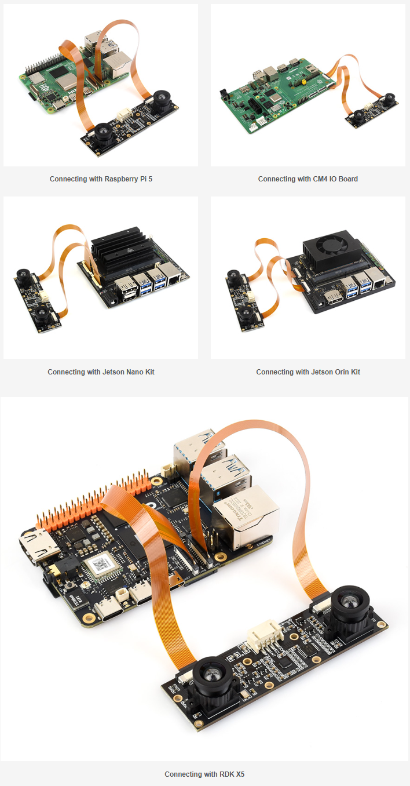

# 쌍안 카메라 모듈, 듀얼 IMX219, 800만 화소, Jetson Nano 및 Raspberry Pi 호환, 스테레오 비전, 깊이 비전

## 목차

- [개요](#개요)
- [사양](#사양)
  - [카메라 (Sony IMX219)](#카메라-sony-imx219)
  - [ICM20948 9축 IMU](#icm20948-9축-imu)
    - [가속도계](#가속도계)
    - [자이로스코프](#자이로스코프)
    - [자력계](#자력계)
  - [물리적 사양](#물리적-사양)
- [Jetson Nano와 함께 사용하기](#jetson-nano와-함께-사용하기)
  - [하드웨어 연결](#하드웨어-연결)
  - [소프트웨어 설정](#소프트웨어-설정)
  - [붉은 색조 이미지 보정](#붉은-색조-이미지-보정)
- [IMU 센서 (ICM20948) 사용 방법](#imu-센서-icm20948-사용-방법)
  - [IMU 테스트](#imu-테스트)
- [Raspberry Pi 5 (Compute Module)와 함께 사용하기](#raspberry-pi-5-compute-module와-함께-사용하기)
- [libcamera 사용법 (Bullseye 이하)](#libcamera-사용법-bullseye-이하)
  - [카메라 활성화](#카메라-활성화)
  - [libcamera 명령어 요약](#libcamera-명령어-요약)
  - [libcamera-hello](#libcamera-hello)
    - [튜닝 파일](#튜닝-파일)
    - [미리보기 창 정보](#미리보기-창-정보)
  - [libcamera-jpeg](#libcamera-jpeg)
    - [노출 제어](#노출-제어)
  - [libcamera-still](#libcamera-still)
    - [인코더 (출력 형식)](#인코더-출력-형식)
    - [RAW 이미지 캡처 (DNG)](#raw-이미지-캡처-dng)
    - [장시간 노출](#장시간-노출)
  - [libcamera-vid](#libcamera-vid)
    - [인코더 (MJPEG / YUV420)](#인코더-mjpeg--yuv420)
    - [UDP 스트리밍 (서버)](#udp-스트리밍-서버)
    - [TCP 스트리밍 (서버)](#tcp-스트리밍-서버)
    - [RTSP 스트리밍 (서버)](#rtsp-스트리밍-서버)
    - [고프레임레이트 모드 (>60fps)](#고프레임레이트-모드-60fps)
  - [libcamera-raw](#libcamera-raw)
  - [libcamera 공통 명령 옵션](#libcamera-공통-명령-옵션)
    - [AWB 모드](#awb-모드)
  - [정지 이미지 촬영 옵션 (libcamera-still)](#정지-이미지-촬영-옵션-libcamera-still)
  - [비디오 녹화 옵션 (libcamera-vid)](#비디오-녹화-옵션-libcamera-vid)
- [RPicam 사용법 (Bookworm 이상)](#rpicam-사용법-bookworm-이상)
  - [카메라 활성화](#카메라-활성화-1)
  - [rpicam-hello](#rpicam-hello)
    - [튜닝 파일](#튜닝-파일-1)
  - [rpicam-jpeg](#rpicam-jpeg)
    - [노출 제어](#노출-제어-1)
  - [rpicam-still](#rpicam-still)
    - [인코더](#인코더)
    - [RAW 이미지 캡처](#raw-이미지-캡처)
    - [초장시간 노출](#초장시간-노출)
  - [rpicam-vid](#rpicam-vid)
    - [인코더](#인코더-1)
    - [고프레임레이트](#고프레임레이트)
    - [Libav 통합](#libav-통합)
    - [UDP 스트리밍 (서버)](#udp-스트리밍-서버-1)
    - [TCP 스트리밍 (서버)](#tcp-스트리밍-서버-1)
    - [RTSP 스트리밍 (서버)](#rtsp-스트리밍-서버-1)
  - [rpicam-raw](#rpicam-raw)
  - [rpicam-detect](#rpicam-detect)
  - [RPicam 파라미터 참조](#rpicam-파라미터-참조)
- [자료](#자료)
  - [데모 코드](#데모-코드)
  - [3D 도면](#3d-도면)
  - [관련 링크](#관련-링크)
  - [데이터시트](#데이터시트)
- [FAQ](#faq)
- [지원](#지원)

---

* 링크:
   * https://www.waveshare.com/product/ai/cameras/imx219-83-stereo-camera.htm?___SID=U
   * https://www.waveshare.com/wiki/IMX219-83_Stereo_Camera

## IMX219-83 스테레오 카메라
### Waveshare IMX219-83 스테레오 카메라 모듈

 <br>
 <br>
 <br>
 <br>

## 개요

카메라당 800만 화소의 듀얼 IMX219 카메라 모듈과 온보드 ICM20948 9축 IMU 센서를 탑재, Jetson Nano 및 Raspberry Pi용으로 설계되었습니다.

---

## 사양
   * 800만 화소
   * 센서: Sony IMX219
   * 해상도: 3280 × 2464 (카메라당)
   * 렌즈 사양:
      * CMOS 크기: 1/4인치
      * 초점 거리: 2.6mm
      * 화각: 83/73/50도 (대각선/수평/수직)
      * 왜곡: <1%
      * 기준선 길이: 60mm
   * ICM20948:
      * 가속도계:
         * 분해능: 16비트
         * 측정 범위 (설정 가능): ±2, ±4, ±8, ±16g
         * 동작 전류: 68.9uA
      * 자이로스코프:
         * 분해능: 16비트
         * 측정 범위 (설정 가능): ±250, ±500, ±1000, ±2000°/초
         * 동작 전류: 1.23mA
      * 자력계:
         * 분해능: 16비트
         * 측정 범위: ±4900μT
         * 동작 전류: 90uA
   * 크기: 24mm × 85mm

### 카메라 (Sony IMX219)

| 파라미터 | 값 |
|-----------|-------|
| 해상도 | 3280 × 2464 (카메라당) |
| 센서 | Sony IMX219 |
| CMOS 크기 | 1/4 인치 |
| 초점 거리 | 2.6 mm |
| 화각 (대각선/수평/수직) | 83° / 73° / 50° |
| 왜곡 | < 1% |
| 기준선 길이 | 60 mm |

### ICM20948 9축 IMU

#### 가속도계

| 파라미터 | 값 |
|-----------|-------|
| 분해능 | 16비트 |
| 측정 범위 (설정 가능) | ±2, ±4, ±8, ±16 g |
| 동작 전류 | 68.9 µA |

#### 자이로스코프

| 파라미터 | 값 |
|-----------|-------|
| 분해능 | 16비트 |
| 측정 범위 (설정 가능) | ±250, ±500, ±1000, ±2000 °/초 |
| 동작 전류 | 1.23 mA |

#### 자력계

| 파라미터 | 값 |
|-----------|-------|
| 분해능 | 16비트 |
| 측정 범위 | ±4900 µT |
| 동작 전류 | 90 µA |

### 물리적 사양

| 크기 |
|-----------|
| 24 mm × 85 mm |

---

## Jetson Nano와 함께 사용하기

### 하드웨어 연결

1. **두 개의 카메라 케이블**을 사용합니다.
2. 케이블의 **금속 면**이 Jetson Nano의 방열판을 향하도록 합니다.
3. 케이블을 **CSI 인터페이스**에 삽입합니다.
4. Jetson Nano를 부팅합니다.

### 소프트웨어 설정

Jetson Nano의 전원을 켜고 터미널을 엽니다 (Ctrl+Alt+T).

#### 1. 비디오 장치 확인

```bash
ls /dev/video*
```

`video0`과 `video1`이 모두 감지되는지 확인합니다.

#### 2. video0 테스트

```bash
DISPLAY=:0.0 nvgstcapture-1.0 --sensor-id=0
```

#### 3. video1 테스트

```bash
DISPLAY=:0.0 nvgstcapture-1.0 --sensor-id=1
```

> **참고**: 테스트 화면은 HDMI 또는 DP로 출력되므로, 테스트 시 Jetson Nano에 디스플레이가 **반드시** 연결되어 있어야 합니다.

#### 붉은 색조 이미지 보정

카메라 이미지가 너무 붉게 나오는 경우:

```bash
# camera-override.isp 파일 다운로드
wget https://files.waveshare.com/upload/e/eb/Camera_overrides.tar.gz
tar zxvf Camera_overrides.tar.gz
sudo cp camera_overrides.isp /var/nvidia/nvcam/settings/

# 파일 설치
sudo chmod 664 /var/nvidia/nvcam/settings/camera_overrides.isp
sudo chown root:root /var/nvidia/nvcam/settings/camera_overrides.isp
```

> **참고**: NV12의 "12"는 숫자이며 문자(l)가 아닙니다.

---

## IMU 센서 (ICM20948) 사용 방법

카메라 모듈에는 온보드 ICM20948 9축 센서가 있습니다. 제공된 4핀 케이블을 통해 Jetson Nano I2C 핀에 연결합니다:


| ICM20948 | Jetson Nano 핀 |
|----------|-----------------|
| SDA | 핀 3 |
| SCL | 핀 5 |

정상 동작에는 SDA와 SCL 핀만 있으면 됩니다.

### IMU 테스트

```bash
# 샘플 데모 다운로드
wget https://files.waveshare.com/upload/e/eb/D219-9dof.tar.gz
tar zxvf D219-9dof.tar.gz
cd D219-9dof/07-icm20948-demo
make
./ICM20948-Demo
```

카메라를 회전시켜 출력 값 변화를 확인합니다.

> **참고**: IMU 데이터와 카메라 데이터는 **타임스탬프 동기화되지 않습니다**.

---

## Raspberry Pi 5 (Compute Module)와 함께 사용하기

IMX219 시리즈 카메라는 다른 Raspberry Pi 카메라와 동일하게 사용할 수 있습니다. Raspberry Pi 5의 경우, 제공된 **22핀 케이블**을 사용하세요.

> **참고**: 카메라 모듈의 ICM20948 로직 레벨은 **3.3V**입니다.

---

## libcamera 사용법 (Bullseye 이하)

Bullseye 버전 이후 Raspberry Pi 카메라 드라이버는 Raspicam에서 **libcamera**로 전환되었습니다. 2023년 12월 11일 기준, 공식 `picamera2` 라이브러리를 Python 데모에 사용할 수 있습니다.

### 카메라 활성화

**Bullseye** 시스템:

```bash
sudo nano /boot/config.txt
```

**Bookworm** 시스템:

```bash
sudo nano /boot/firmware/config.txt
```

끝에 다음을 추가:

```bash
dtoverlay=imx219,cam0
dtoverlay=imx219,cam1
```

재부팅:

```bash
sudo reboot
```

두 카메라 테스트:

```bash
libcamera-hello -t 0 --camera 0
libcamera-hello -t 0 --camera 1
```

> **참고**: `libcamera-*`는 Bookworm에서 더 이상 사용되지 않습니다 — `rpicam-*`를 대신 사용하세요 ([RPicam 섹션](#rpicam-사용법-bookworm-이상) 참조).

### libcamera 명령어 요약

| 명령어 | 설명 |
|---------|-------------|
| `libcamera-hello` | 간단한 "hello world" — 약 5초간 카메라 미리보기 |
| `libcamera-jpeg` | JPEG 정지 이미지 캡처 |
| `libcamera-still` | 고급 정지 이미지 캡처 (`raspistill`과 유사) |
| `libcamera-vid` | 비디오 녹화 (H.264, MJPEG, YUV420) |
| `libcamera-raw` | 원시 Bayer 프레임 녹화 |

---

### libcamera-hello

약 5초간 화면에 카메라 미리보기:

```bash
libcamera-hello
```

무기한 미리보기 유지:

```bash
libcamera-hello -t 0
```

#### 튜닝 파일

기본 튜닝 파일 재정의:

```bash
libcamera-hello --tuning-file /usr/share/libcamera/ipa/raspberrypi/imx219_noir.json
```

#### 미리보기 창 정보

미리보기 창 제목에 초점 측정값 표시:

```bash
libcamera-hello --info-text "Focus measure: %focus"
```

기본 `--info-text`: `"#%frame (%fps fps) exp %exp ag %ag dg %dg"`

| 지시어 | 설명 |
|-----------|-------------|
| `%frame` | 프레임 시퀀스 번호 |
| `%fps` | 순간 프레임레이트 |
| `%exp` | 셔터 속도 (ms) |
| `%ag` | 아날로그 게인 (센서 칩) |
| `%dg` | 디지털 게인 (ISP) |
| `%rg` | 적색 성분 게인 |
| `%bg` | 청색 성분 게인 |
| `%focus` | 코너 검출 측정값 (높을수록 선명) |
| `%lp` | 렌즈 디옵터 (1/거리(미터)) |
| `%afstate` | 자동초점 상태 (대기 중, 스캔 중, 초점 맞춤, 실패) |

---

### libcamera-jpeg

전체 해상도 JPEG 캡처:

```bash
libcamera-jpeg -o test.jpg
```

사용자 지정 미리보기 시간 및 해상도:

```bash
libcamera-jpeg -o test.jpg -t 2000 --width 640 --height 480
```

#### 노출 제어

고정 셔터 (20ms) 및 게인 (1.5배):

```bash
libcamera-jpeg -o test.jpg -t 2000 --shutter 20000 --gain 1.5
```

노출 보정 (EV):

```bash
libcamera-jpeg --ev -0.5 -o darker.jpg
libcamera-jpeg --ev 0 -o normal.jpg
libcamera-jpeg --ev 0.5 -o brighter.jpg
```

---

### libcamera-still

사진 촬영:

```bash
libcamera-still -o test.jpg
```

#### 인코더 (출력 형식)

```bash
libcamera-still -e png -o test.png
libcamera-still -e bmp -o test.bmp
libcamera-still -e rgb -o test.data
libcamera-still -e yuv420 -o test.data
```

> 형식은 파일 확장자가 아닌 `-e` (인코딩) 옵션으로 제어됩니다.

#### RAW 이미지 캡처 (DNG)

```bash
libcamera-still -r -o test.jpg
```

JPEG와 함께 DNG 파일도 저장됩니다 (예: `test.dng`).

DNG 메타데이터 (`exiftool` 사용):

```
File Name                       : test.dng
Make                            : Raspberry Pi
Camera Model Name               : /base/soc/i2c0mux/i2c@1/imx477@1a
Image Width                     : 4056
Image Height                    : 3040
Bits Per Sample                 : 16
Compression                     : Uncompressed
Photometric Interpretation      : Color Filter Array
CFA Pattern 2                   : 2 1 1 0
Black Level                     : 256 256 256 256
White Level                     : 4095
Exposure Time                   : 1/20
ISO                             : 400
Image Size                      : 4056x3040
Megapixels                      : 12.3
```

#### 장시간 노출

AEC/AGC 및 AWB 비활성화, 미리보기 건너뛰기:

```bash
libcamera-still -o long_exposure.jpg --shutter 100000000 --gain 1 --awbgains 1,1 --immediate
```

**최대 노출 시간 (참고):**

| 모듈 | 최대 노출 (초) |
|--------|-----------------|
| V1 (OV5647) | 6 |
| V2 (IMX219) | 11.76 |
| V3 (IMX708) | 112 |
| HQ (IMX477) | 670 |

---

### libcamera-vid

10초 H.264 비디오 녹화:

```bash
libcamera-vid -t 10000 -o test.h264
```

VLC로 재생:

```bash
vlc test.h264
```

리패키징용 타임스탬프 저장:

```bash
libcamera-vid -o test.h264 --save-pts timestamps.txt
```

MKV로 변환:

```bash
mkvmerge -o test.mkv --timecodes 0:timestamps.txt test.h264
```

#### 인코더 (MJPEG / YUV420)

```bash
libcamera-vid -t 10000 --codec mjpeg -o test.mjpeg
libcamera-vid -t 10000 --codec yuv420 -o test.data
```

MJPEG를 개별 프레임으로 분할:

```bash
libcamera-vid -t 10000 --codec mjpeg --segment 1 -o test%05d.jpeg
```

#### UDP 스트리밍 (서버)

```bash
libcamera-vid -t 0 --inline -o udp://<ip-주소>:<포트>
```

클라이언트 (VLC):

```bash
vlc udp://@:<포트> :demux=h264
```

#### TCP 스트리밍 (서버)

```bash
libcamera-vid -t 0 --inline --listen -o tcp://0.0.0.0:<포트>
```

클라이언트:

```bash
vlc tcp/h264://<서버-ip-주소>:<포트>
ffplay tcp://<서버-ip-주소>:<포트> -vf "setpts=N/30" -fflags nobuffer -flags low_delay -framedrop
```

#### RTSP 스트리밍 (서버)

```bash
libcamera-vid -t 0 --inline -o - | cvlc stream:///dev/stdin --sout '#rtp{sdp=rtsp://:8554/stream1}' :demux=h264
```

클라이언트:

```bash
vlc rtsp://<서버-ip-주소>:8554/stream1
ffplay rtsp://<서버-ip-주소>:8554/stream1 -vf "setpts=N/30" -fflags nobuffer -flags low_delay -framedrop
```

> `-n` (nopreview)으로 미리보기 창을 비활성화할 수 있습니다. `--inline`을 사용하여 각 I-프레임에 헤더 정보를 포함합니다.

#### 고프레임레이트 모드 (>60fps)

```bash
libcamera-vid --level 4.2 --framerate 120 --width 1280 --height 720 --save-pts timestamp.pts -o video.264 -t 10000 --denoise cdn_off -n
```

권장 사항:
- H.264 레벨을 4.2로 설정: `--level 4.2`
- 컬러 노이즈 제거 비활성화: `--denoise cdn_off`
- 미리보기 창 닫기: `-n`
- `/boot/config.txt`에 `force_turbo=1` 추가
- ISP 출력 해상도 조정 (예: `--width 1280 --height 720`)
- 선택적으로 GPU 오버클럭: `/boot/config.txt`에 `gpu_freq=550` (Pi 4+)

---

### libcamera-raw

2초 원시 Bayer 데이터 녹화:

```bash
libcamera-raw -t 2000 -o test.raw
```

개별 프레임으로 분할:

```bash
libcamera-raw -t 2000 --segment 1 -o test%05d.raw
```

드롭 방지를 위한 프레임레이트 감소 (HQ 카메라, 12 MP):

```bash
libcamera-raw -t 5000 --width 4056 --height 3040 -o test.raw --framerate 8
```

---

### libcamera 공통 명령 옵션

| 옵션 | 설명 |
|--------|-------------|
| `--help, -h` | 도움말 출력 |
| `--version` | libcamera 및 libcamera-app 버전 출력 |
| `--list-cameras` | 감지된 카메라 및 지원 모드 목록 |
| `--camera` | 인덱스로 카메라 지정 (0, 1, ...) |
| `--config, -c` | 설정 파일에서 옵션 로드 |
| `--timeout, -t` | 실행 시간 (ms, 기본값: 5000, `0` = 무한) |
| `--preview, -p` | 미리보기 창 위치/크기: `<x,y,w,h>` |
| `--fullscreen, -f` | 전체화면 미리보기 |
| `--qt-preview` | Qt 기반 미리보기 창 |
| `--nopreview, -n` | 미리보기 창 비활성화 |
| `--info-text` | `%지시어`로 미리보기 창 제목 설정 |
| `--width` / `--height` | 출력 이미지/비디오 해상도 |
| `--viewfinder-width/height` | 미리보기 스트림 해상도 |
| `--rawfull` | 전체 해상도 읽기 모드 강제 |
| `--mode` | 카메라 모드 설정: `<너비>:<높이>:<비트심도>:<패킹>` |
| `--viewfinder-mode` | 미리보기용 카메라 모드 (`--mode`와 동일 형식) |
| `--lores-width` / `--lores-height` | 저해상도 이미지 스트림 |
| `--hflip` | 이미지 수평 뒤집기 |
| `--vflip` | 이미지 수직 뒤집기 |
| `--rotation` | 이미지 회전 (0 또는 180) |
| `--roi` | 이미지 자르기: `<x,y,w,h>` (값 0–1) |
| `--hdr` | HDR 모드 (지원 카메라만 해당, off/auto/single-exp) |
| `--sharpness` | 선명도 (0.0 = 없음, 1.0 = 기본, >1.0 = 추가) |
| `--contrast` | 대비 (0.0 = 최소, 1.0 = 기본, >1.0 = 추가) |
| `--brightness` | 밝기 (-1.0 ~ 1.0) |
| `--saturation` | 채도 (0.0 = 흑백, 1.0 = 기본, >1.0 = 추가) |
| `--ev` | EV 보정 (-10 ~ 10) |
| `--shutter` | 노출 시간 (µs) |
| `--gain` / `--analoggain` | 아날로그 + 디지털 게인 결합 |
| `--metering` | 측광 모드: `centre`, `spot`, `average`, `custom` |
| `--exposure` | 노출 프로필: `sport`, `normal`, `long` |
| `--awb` | 화이트 밸런스 모드 (아래 표 참조) |
| `--awbgains` | 고정 적색/청색 게인: `<적색_게인>,<청색_게인>` |
| `--denoise` | 노이즈 제거: `auto`, `off`, `cdn_off`, `cdn_fast`, `cdn_hq` |
| `--tuning-file` | 사용자 지정 카메라 튜닝 파일 |
| `--autofocus-mode` | `default`, `manual`, `auto`, `continuous` |
| `--autofocus-range` | `normal`, `macro`, `full` |
| `--autofocus-speed` | `normal`, `fast` |
| `--autofocus-window` | AF 창: `<x,y,w,h>` (값 0–1) |
| `--lens-position` | 고정 렌즈 위치 (0.0 = 무한대, 디옵터 단위) |
| `--output, -o` | 출력 파일명 또는 URL |
| `--wrap` | 출력 파일 카운터 감싸기 |
| `--flush` | 출력 파일 즉시 플러시 |

#### AWB 모드

| 모드 | 색온도 |
|------|-------------------|
| `auto` | 2500K ~ 8000K |
| `incandescent` | 2500K ~ 3000K |
| `tungsten` | 3000K ~ 3500K |
| `fluorescent` | 4000K ~ 4700K |
| `indoor` | 3000K ~ 5000K |
| `daylight` | 5500K ~ 6500K |
| `cloudy` | 7000K ~ 8500K |
| `custom` | 사용자 지정 범위 (튜닝 파일) |

---

### 정지 이미지 촬영 옵션 (libcamera-still)

| 옵션 | 설명 |
|--------|-------------|
| `-q, --quality` | JPEG 이미지 품질 (0–100) |
| `-x, --exif` | 추가 EXIF 태그 추가 |
| `--timelapse` | 타임랩스 간격 (ms) |
| `--framestart` | 시작 프레임 카운트 |
| `--datetime` | 날짜 형식으로 출력 파일 이름 지정 |
| `--timestamp` | 시스템 타임스탬프로 출력 파일 이름 지정 |
| `--restart` | JPEG 재시작 간격 |
| `-k, --keypress` | Enter 키 사진 모드 |
| `-s, --signal` | 신호 트리거 사진 모드 |
| `--thumb` | 썸네일 파라미터 (`<w:h:q>`) |
| `-e, --encoding` | 이미지 인코딩: `jpg`, `png`, `bmp`, `rgb`, `yuv420` |
| `-r, --raw` | 원시 DNG 이미지 저장 |
| `--latest` | 마지막 저장 파일로의 심볼릭 링크 |
| `--autofocus-on-capture` | 캡처 전 한 번 초점 맞추기 |

### 비디오 녹화 옵션 (libcamera-vid)

| 옵션 | 설명 |
|--------|-------------|
| `-q, --quality` | JPEG 품질 (0–100) |
| `-b, --bitrate` | H.264 비트레이트 |
| `-g, --intra` | 인트라 프레임 주기 (H.264) |
| `--profile` | H.264 프로필 |
| `--level` | H.264 레벨 |
| `--codec` | 인코딩 유형: `h264`, `mjpeg`, `yuv420` |
| `-k, --keypress` | Enter 키로 녹화 일시정지/재개 |
| `-s, --signal` | 신호로 일시정지/재개 |
| `--initial` | 녹화 또는 일시정지 상태로 시작 |
| `--split` | 다른 파일로 비디오 분할 |
| `--segment` | 비디오를 여러 세그먼트로 분할 (ms) |
| `--circular` | 순환 버퍼에 쓰기 |
| `--inline` | 각 I-프레임에 헤더 쓰기 (H.264) |
| `--listen` | TCP 연결 대기 |
| `--frames` | 녹화할 프레임 수 설정 |

---

## RPicam 사용법 (Bookworm 이상)

Bookworm에서는 `libcamera-*`를 `rpicam-*`로 대체합니다. `libcamera`도 여전히 작동하지만 더 이상 사용되지 않으므로 가능한 빨리 `rpicam`으로 마이그레이션하세요.

시스템 버전 확인:

```bash
sudo cat /etc/os-release
```

### 카메라 활성화

```bash
sudo nano /boot/firmware/config.txt
```

추가:

```bash
dtoverlay=imx219,cam0
dtoverlay=imx219,cam1
```

재부팅:

```bash
sudo reboot
```

테스트:

```bash
rpicam-hello -t 0 --camera 0
rpicam-hello -t 0 --camera 1
```

### rpicam-hello

```bash
rpicam-hello          # 5초 미리보기
rpicam-hello -t 0     # 연속 미리보기
```

#### 튜닝 파일

Raspberry Pi 4 이하:

```bash
rpicam-hello --tuning-file /usr/share/libcamera/ipa/rpi/vc4/imx219_noir.json
```

Raspberry Pi 5:

```bash
rpicam-hello --tuning-file /usr/share/libcamera/ipa/rpi/pisp/imx219_noir.json
```

### rpicam-jpeg

```bash
rpicam-jpeg -o test.jpg
rpicam-jpeg -o test.jpg -t 2000 --width 640 --height 480
```

#### 노출 제어

```bash
rpicam-jpeg -o test.jpg -t 2000 --shutter 20000 --gain 1.5
```

EV 보정:

```bash
rpicam-jpeg --ev -0.5 -o darker.jpg
rpicam-jpeg --ev 0 -o normal.jpg
rpicam-jpeg --ev 0.5 -o brighter.jpg
```

### rpicam-still

```bash
rpicam-still -o test.jpg
```

#### 인코더

```bash
rpicam-still -e png -o test.png
rpicam-still -e bmp -o test.bmp
rpicam-still -e rgb -o test.data
rpicam-still -e yuv420 -o test.data
```

#### RAW 이미지 캡처

```bash
rpicam-still --raw --output test.jpg
```

#### 초장시간 노출

```bash
rpicam-still -o long_exposure.jpg --shutter 100000000 --gain 1 --awbgains 1,1 --immediate
```

### rpicam-vid

```bash
rpicam-vid -t 10s -o test.h264
```

Raspberry Pi 5에서는 MP4로 직접 출력:

```bash
rpicam-vid -t 10s -o test.mp4
```

#### 인코더

```bash
rpicam-vid -t 10000 --codec mjpeg -o test.mjpeg
rpicam-vid -t 10000 --codec yuv420 -o test.data
```

MJPEG를 개별 프레임으로 분할:

```bash
rpicam-vid -t 10000 --codec mjpeg --segment 1 -o test%05d.jpeg
```

#### 고프레임레이트

```bash
rpicam-vid --level 4.2 --framerate 120 --width 1280 --height 720 --save-pts timestamp.pts -o video.264 -t 10000 --denoise cdn_off -n
```

#### Libav 통합

```bash
rpicam-vid --codec libav --libav-format avi --libav-audio --output example.avi
```

#### UDP 스트리밍 (서버)

```bash
rpicam-vid -t 0 --inline -o udp://<ip-주소>:<포트>
```

클라이언트:

```bash
vlc udp://@:<포트> :demux=h264
ffplay udp://<서버-ip-주소>:<포트> -fflags nobuffer -flags low_delay -framedrop
```

#### TCP 스트리밍 (서버)

```bash
rpicam-vid -t 0 --inline --listen -o tcp://0.0.0.0:<포트>
```

클라이언트:

```bash
vlc tcp/h264://<서버-ip-주소>:<포트>
ffplay tcp://<서버-ip-주소>:<포트> -vf "setpts=N/30" -fflags nobuffer -flags low_delay -framedrop
```

#### RTSP 스트리밍 (서버)

```bash
rpicam-vid -t 0 --inline -o - | cvlc stream:///dev/stdin --sout '#rtp{sdp=rtsp://:8554/stream1}' :demux=h264
```

클라이언트:

```bash
vlc rtsp://<서버-ip-주소>:8554/stream1
ffplay rtsp://<서버-ip-주소>:8554/stream1 -vf "setpts=N/30" -fflags nobuffer -flags low_delay -framedrop
```

### rpicam-raw

```bash
rpicam-raw -t 2000 -o test.raw
rpicam-raw -t 2000 --segment 1 -o test%05d.raw
rpicam-raw -t 5000 --width 4056 --height 3040 -o test.raw --framerate 8
```

### rpicam-detect

TensorFlow Lite가 설치되어 있어야 합니다. MobileNet v1 SSD (COCO 데이터셋, 약 80개 클래스)를 사용한 객체 감지.

```bash
rpicam-detect -t 0 -o cat%04d.jpg --lores-width 400 --lores-height 300 --post-process-file object_detect_tf.json --object cat
```

### RPicam 파라미터 참조

| 옵션 | 설명 |
|--------|-------------|
| `-h, --help` | 모든 옵션 출력 |
| `--version` | 버전 문자열 출력 (libcamera + rpicam-apps) |
| `--list-cameras` | 연결된 카메라 및 센서 모드 목록 |
| `--camera` | 인덱스로 카메라 선택 |
| `-c, --config` | 파일에서 옵션 로드 |
| `-t, --timeout` | 실행 시간 (ms, 기본값: 5000) |
| `--preview` | 미리보기 창: `<x,y,w,h>` |
| `-f, --fullscreen` | 전체화면 미리보기 |
| `--qt-preview` | Qt 미리보기 창 |
| `--nopreview` | 미리보기 비활성화 |
| `--info-text` | `%지시어`로 미리보기 창 제목 설정 |
| `--width` / `--height` | 출력 해상도 |
| `--viewfinder-width/height` | 미리보기 스트림 해상도 |
| `--mode` | 카메라 모드: `<너비>:<높이>:<비트심도>:<패킹>` |
| `--viewfinder-mode` | 미리보기 카메라 모드 |
| `--lores-width/height` | 저해상도 스트림 |
| `--hflip` / `--vflip` | 수평 / 수직 뒤집기 |
| `--rotation` | 회전 (0 또는 180) |
| `--roi` | 자르기: `<x,y,w,h>` (0–1) |
| `--hdr` | HDR 모드 (`off` / `auto` / `single-exp`) |
| `--sharpness` | 선명도 (0.0–1.0–>1.0) |
| `--contrast` | 대비 (0.0–1.0–>1.0) |
| `--brightness` | 밝기 (-1.0 ~ 1.0) |
| `--saturation` | 채도 (0.0–1.0–>1.0) |
| `--ev` | EV 보정 (-10 ~ 10) |
| `--shutter` | 셔터 속도 (µs) |
| `--gain` | 아날로그 + 디지털 게인 결합 |
| `--metering` | 측광: `centre`, `spot`, `average`, `custom` |
| `--exposure` | 프로필: `sport`, `normal`, `long` |
| `--awb` | 화이트 밸런스 모드 |
| `--awbgains` | 고정 컬러 게인: `<적색>,<청색>` |
| `--denoise` | 노이즈 제거: `auto`, `off`, `cdn_off`, `cdn_fast`, `cdn_hq` |
| `--tuning-file` | 카메라 튜닝 파일 경로 |
| `--autofocus-mode` | `default`, `manual`, `auto`, `continuous` |
| `--autofocus-range` | `normal`, `macro`, `full` |
| `--autofocus-speed` | `normal`, `fast` |
| `--autofocus-window` | AF 창: `<x,y,w,h>` |
| `--lens-position` | 고정 렌즈 위치 (디옵터) |
| `--verbose, -v` | 상세도: 0 (없음), 1 (보통), 2 (상세) |

---

## 자료

### 데모 코드

- [MPU9250 데모](https://files.waveshare.com/upload/e/eb/D219-9dof.tar.gz)
- [캘리브레이션 예제가 포함된 데모 코드](https://files.waveshare.com/upload/e/eb/D219-9dof.tar.gz)

### 3D 도면

- [IMX210-83 스테레오 카메라 3D 도면](https://www.waveshare.com/w/upload/4/4e/IMX219-83-Stereo-Camera-3D-Drawing.zip)

### 관련 링크

| 자료 | URL |
|----------|-----|
| Jetson Nano 포럼 | https://forums.developer.nvidia.com/c/accelerated-computing/intelligent-video-analytics/jetson-embedded-systems/ |
| Nvidia Jetson GitHub | https://github.com/jetsonhacks |
| Jetson Nano 개발자 키트 | https://developer.nvidia.com/embedded/learn/get-started-jetson-nano-devkit |
| Jetson Nano 시작하기 | https://developer.nvidia.com/embedded/learn/get-started-jetson-nano-devkit |
| NVIDIA 멀티미디어 문서 | https://docs.nvidia.com/jetson/archives/l4t-multimedia/ |
| Jetson Nano 개발자 키트 사용자 가이드 | https://developer.nvidia.com/embedded/dlc/jetson-nano-dev-kit-user-guide |
| Jetson Nano 개발자 키트 3D 도면 | https://developer.nvidia.com/embedded/dlc/jetson-nano-dev-kit-3d-drawing |
| NVIDIA 공식 무료 AI 튜토리얼 | https://developer.nvidia.com/embedded/learn/jetson-nano-education-projects |

### 데이터시트

- [ICM20948 데이터시트](https://files.waveshare.com/upload/1/18/DS-000189-ICM-20948-v1.3.pdf)

---

## FAQ

**Q: 카메라가 Cheese에서 작동하지 않는 이유는 무엇인가요?**

A: Cheese는 USB 카메라에서만 작동합니다. IMX219 시리즈는 CSI 인터페이스를 사용합니다. 대신 제공된 테스트 명령어를 사용하세요.

---

**Q: OpenCV에서 카메라가 작동하지 않습니다.**

A: CSI 카메라는 Gstreamer 파이프라인을 통해 작동합니다. Gstreamer 통합 호출 방법을 확인하세요.

---

**Q: IMX219 시리즈의 작동 온도 범위는 어떻게 되나요?**

A: 0–60 °C입니다.

---

**Q: 카메라 모듈의 ICM20948 로직 레벨은 어떻게 되나요?**

A: 3.3V입니다.

---

**Q: IMU 데이터와 카메라 데이터가 타임스탬프 동기화되나요?**

A: 아니요, 동기화되지 않습니다.

---

**Q: 두 카메라의 프레임을 동기화할 방법이 있나요?**

A: IMX219-83은 하드웨어 동기화 기능을 제공하지 않아 프레임 동기화가 어렵습니다.

---

## IMX219 시리즈 카메라 모듈 선택 가이드

Waveshare IMX219 기반 카메라 모듈 비교.

| 제품 | 화소 | 센서 | 적외선 | 카메라 수 | 화각 (대각) | 조리개 (F) | 초점 거리 | PCBA | 호환 플랫폼 |
|---------|--------|--------|----------|---------|-------------|--------------|--------------|------|---------------------|
| RPi Camera V2 | 8M | IMX219 | × | 1 | 62.2° | 2.0 | 3.04 mm | √ | Raspberry Pi, CM3/3+/4, Jetson Nano, Jetson Xavier NX, VisionFive2 |
| RPi NoIR Camera V2 | 8M | IMX219 | √ | 1 | 62.2° | 2.0 | 3.04 mm | √ | Raspberry Pi, CM3/3+/4, Jetson Nano, VisionFive2 |
| IMX219-77 Camera | 8M | IMX219 | × | 1 | 79.3° | 2.0 | 2.85 mm | √ | Raspberry Pi, CM3/3+/4, Jetson 시리즈, VisionFive2 |
| IMX219-77IR Camera | 8M | IMX219 | √ | 1 | 79.3° | 2.0 | 2.85 mm | √ | Raspberry Pi, CM3/3+/4, Jetson 시리즈, VisionFive2 |
| IMX219-120 Camera | 8M | IMX219 | × | 1 | 120° | 2.0 | 1.79 mm | √ | Raspberry Pi, CM3/3+/4, Jetson 시리즈, VisionFive2 |
| IMX219-160 Camera | 8M | IMX219 | × | 1 | 160° | 2.35 | 3.15 mm | √ | Raspberry Pi, CM3/3+/4, Jetson 시리즈, VisionFive2 |
| IMX219-160IR Camera | 8M | IMX219 | √ | 1 | 160° | 2.35 | 3.15 mm | √ | Raspberry Pi, CM3/3+/4, Jetson 시리즈, VisionFive2 |
| IMX219-160 IR-CUT Camera | 8M | IMX219 | √ | 1 | 162.4° | 2.7 | 1.75 mm | √ | Raspberry Pi, CM3/3+/4, Jetson 시리즈, VisionFive2 |
| IMX219-170 Camera | 8M | IMX219 | × | 1 | 170° | 2.4 | 2.2 mm | √ | Raspberry Pi, CM3/3+/4, Jetson 시리즈, VisionFive2 |
| IMX219-200 Camera | 8M | IMX219 | × | 1 | 200° | 2.0 | 0.87 mm | √ | Raspberry Pi, CM3/3+/4, Jetson 시리즈, VisionFive2 |
| **IMX219-83 Stereo Camera** | **8M** | **IMX219** | **×** | **2** | **83°** | **2.4** | **2.6 mm** | **√** | **Raspberry Pi, CM3/3+/4, Jetson 시리즈** |
| IMX219-D160 | 8M | IMX219 | × | 1 | 160° | 2.35 | 3.15 mm | × | Raspberry Pi, CM3/3+/4, Jetson 시리즈, VisionFive2 |

## 범례

| 기호 | 의미 |
|--------|---------|
| √ | 지원 |
| × | 미지원 |

## 참고 사항

- **모든 모듈**은 Sony IMX219 센서 사용 (800만 화소, 3280 × 2464).
- **적외선**: `√`는 NoIR 버전 (적외선 필터 없음)을 의미.
- **PCBA**: `×`는 PCBA 어댑터 없이 베어 보드로 판매되는 모듈.
- **IMX219-83**은 라인업 중 유일한 스테레오 (듀얼 카메라) 모델.
